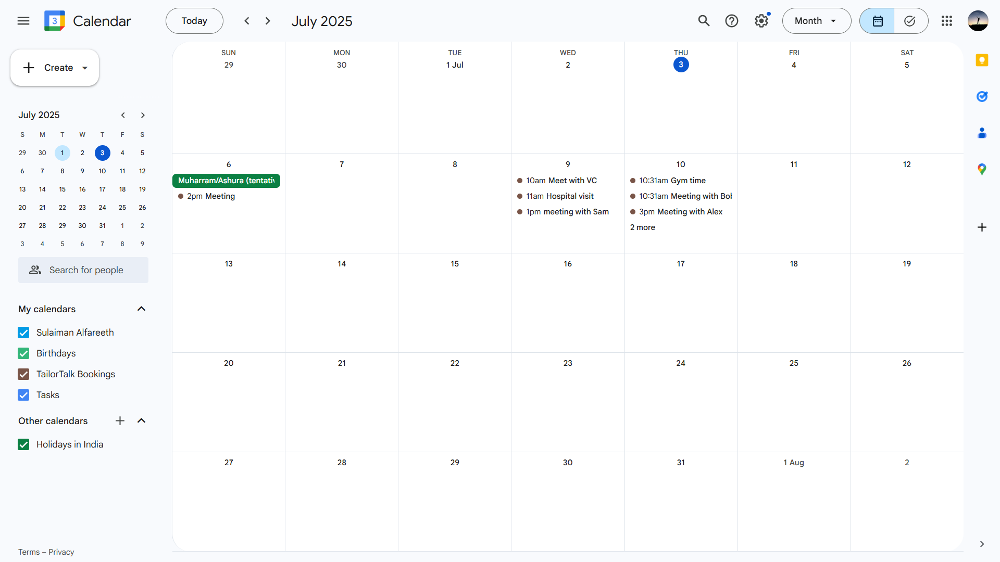

# CalendarBot

> An AI-powered conversational assistant to manage your Google Calendar with natural language.

---

## What is CalendarBot? (read full instructions 🙏)
CalendarBot is a fully conversational AI assistant built using FastAPI, LangChain, and Gemini LLM APIs to handle your Google Calendar. 

You can check the calendar bot live and see the publicly available calendar to see the schedulings reflected on the calendar or not. (Don't abuse the bot or give too many requests 🙏 I'm running on limited requests per day. (TailorTalk reviewers may try whatever they want))

It can:
- 🗓️ Book new events
- 🔍 Check availability
- ♻️ Reschedule existing events
- ❌ Cancel/delete events
- 📋 Summarize your schedule
- 🧠 Handle multiple tool calls in a single user request

All through natural back-and-forth conversations!


## 🖼️ Demo Screens

### 🧠 Intelligent Conversations


### 📅 Calendar Changes


---

## Tech Stack

| Component | Stack |
|----------|--------|
| Backend  | Python 3.12, FastAPI |
| Frontend | Streamlit |
| AI Model | Google Gemini API (`gemini-2.5-flash`) |
| Agent Framework | LangChain Tools (custom wrapper) |
| Calendar Integration | Google Calendar API (Service Account) |
| Deployment-ready | Yes (Railway, Render, etc.) |

> 💡 You can change the Gemini model (e.g., to `gemini-2.0-flash`, `gemini-2.5-pro`, etc.) by modifying the `GenerativeModel(...)` name in `agent.py`.

---

## 🗂️ Project Structure
```
tailortalk
├── backend
│   ├── main.py               # FastAPI backend
│   ├── agent.py              # Chat agent logic & Gemini tool integration
│   ├── calendar_tools.py     # Google Calendar integration functions
│
├── frontend
│   ├── app.py                # Streamlit UI interface
│
├── credentials
│   ├── <service_account>.json # Google service account file
│
├── .env                      # All environment variables
└── README.md
```

---

## ⚙️ Setup Instructions

### 1. Clone the Repo
```bash
git clone https://github.com/your-username/calendarbot.git
cd calendarbot
```

### 2. Create & Activate Virtual Environment
```bash
python -m venv venv
```
Open two terminals:
- In **both** terminals, activate the virtual environment:
  ```bash
  On Windows: venv\Scripts\activate # On mac/linux: source venv/bin/activate  
  ```

### 3. Install Requirements
```bash
pip install -r requirements.txt
```

### 4. Setup `.env`
Create a `.env` file in the root:
```
GOOGLE_API_KEY=your_google_gemini_api_key
GOOGLE_CREDENTIALS_PATH=credentials/your_service_account.json
CALENDAR_ID=your_calendar_id@group.calendar.google.com
```

> ✅ Make sure your calendar has **editor access** given to the service account. If not, create a cloud project on google cloud console and copy the service account id and add it in your calendar, and give it the 'make changes to event' permission.


### 5. Run the App
In the **first terminal** (backend):
```bash
cd backend
uvicorn main:app --reload
```
In the **second terminal** (frontend):
```bash
cd frontend
streamlit run app.py
```

---

## 🚀 Features

### ✅ Natural Language Commands
- "Book me a dentist appointment on July 10th at 10am."
- "Reschedule the meeting with Bob two hours later."
- "Delete the hospital appointment."
- "What do I have on July 9, 2025?"

### ✅ Smart Tool Chaining
> Automatically detects multiple actions:
- Reschedules an event *and* books a new one in one go.

### ✅ Flexible Time Logic
- Understands:
  - "Move 2 hours ahead"
  - "Postpone by 1 hour"
  - "Back-to-back meetings"
  - "Shift event 90 minutes earlier"

### ✅ Conflict Resolution
- Detects overlaps automatically
- Suggests alternatives
- Optionally reschedules conflicting events

### ✅ Safe Deletion
- Asks for confirmation before deleting
- Handles missing event names/dates/times gracefully

---

## Tested Edge Cases (Cooked it ✅)

- Booking overlapping events ➜ gets rejected or rescheduled
- Rescheduling with vague commands ➜ prompts clarification
- "Shift X meeting to 1 hour later" ➜ applies correct logic
- Deleting non-existent events ➜ handled gracefully
- Mixing booking and rescheduling in one command ➜ success
- Natural follow-up queries like "And now what's on my schedule?" ➜ accurate list
- Trying to book without time ➜ asks for missing time
- Trying to book with only partial date ➜ confirms year if missing

---

## Error Handling 💀

- ❌ Backend down ➜ "⚠️ Backend is offline. Try again later."
- ❌ API quota exhausted ➜ "😔 Sorry, we ran out of free messages today. Limit resets at 12:30 PM IST."
- ❌ General errors ➜ "⚠️ Something unexpected happened. Please try again later."

---

##  Hosting
You can host the app using platforms like:
- Railway
- Render
- Fly.io

Make sure to:
1. Upload the service account `.json` securely
2. Add all `.env` vars in the hosting environment
3. Enable public access for Streamlit frontend

---

## 🔗 Live Demo & Calendar Access
- 🌍 [Check the Chatbot here in live](https://calendarbot-tailortalk.streamlit.app/)
- 📅 [View the Shared Public Calendar](https://calendar.google.com/calendar/u/0?cid=Njc4OGRlYTVhOWFiNTk4MWIwOGZlNjQ0YTcwNmJjMzU0NDQxMDE4ZGZhZjFjYmZhYTRlNTQzMzk3YmFhOGU5ZEBncm91cC5jYWxlbmRhci5nb29nbGUuY29t)

---


If you found this project helpful, feel free to ⭐ it or reach out!  And TailorTalk may proceed me to the next round 😅

